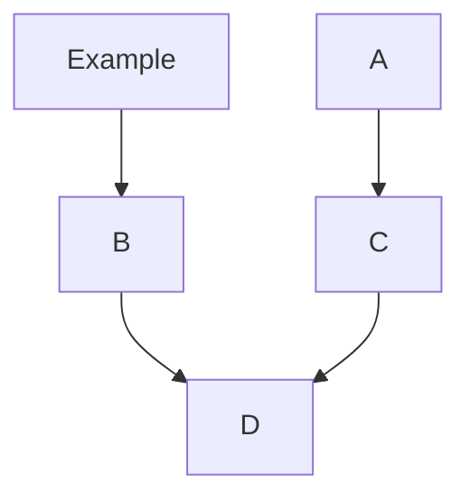

# Setup Instructions for FTC Robot Controller and PC

## Requirements:
* 64 bit computer running Windows 7 or newer
* USB to USB Type-C cable
* Controller Hub battery

## Setup Process
* In your browser, go to https://www.revrobotics.com/software/
* Click on the `REV Hardware Client` link
* Install the latest version of the `REV Hardware Client`
* *picture*
* Run the installer that is downloaded
* *picture*
* Open the program 
* *picture*
* Plug the battery into your robot control hub
* Plug the USB Type-C cable into the robot, connecting it to your computer. (The rectangle side goes into your computer)
* *image*
* Refresh the application window. Your robot should be listed.
* 

