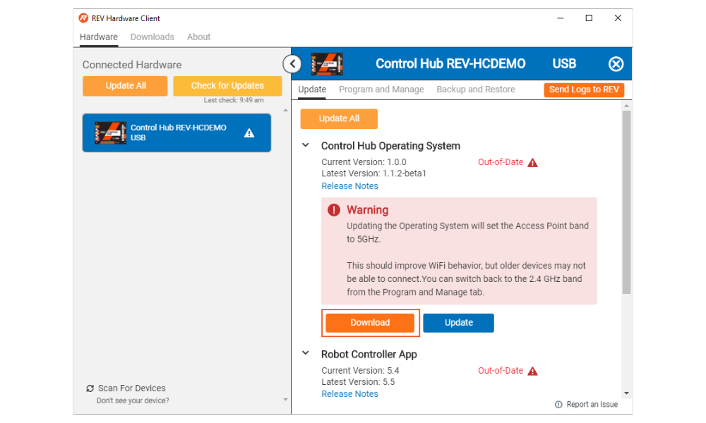

# Updating Control Hub

## Update All

Once one or more supported REV Hardware devices are connected that require updates, the **Update All** button will appear.

Once Update All is selected the REV Hardware Client will confirm the updates for all connected devices. Select Update to download and update all devices.

## Individual Updates

### Operating System

After selecting the Connected Hardware the Update tab will pop up. Under **Control Hub Operating System** select Download.

Once the OS has downloaded, select Update.

Keep the Control Hub powered while the upload finishes.

A successful upload will be denoted by the "Update Verification Succeeded" message highlighted in the image below. Once the upload is successful the install will begin.

Keep the Control Hub powered while the update is installed. The Control Hub will reboot to complete the update.

When the OS update has completed a status message "Operating System update complete." The status for the Control Hub Operation System will also change to "Up-to-Date."

### Firmware

There are two boards within the Control Hub: an Expansion Hub \*\*\*\*and an Android controller. The Expansion Hub board built into the Control Hub, facilitates a line of communication between the built in Robot Controller and the motors, servos, and sensors. In order to improve the quality of the Hubs, REV Robotics will release firmware updates for the Expansion Hub. When a firmware release occurs, both Control Hub and Expansion Hub users will need to update their Expansion Hub firmware to the newest version.


In order to use the REV Hardware Client for firmware updates, the Robot Controller Application must first be updated to version 5.5. After updating the application you may need to close out of the REV Hardware Client in order for the firmware update to be available.


After selecting the Connected Hardware the Update tab will pop up. Under **Hub Firmware** select Download.

Once the firmware has downloaded, select Update.

When the firmware update has completed a status message "Firmware successfully updated" The status for the Hub Firmware will also change to "Up-to-Date."

### Robot Controller Application

After selecting the Connected Hardware the Update tab will pop up. Under **Robot Controller App** select Download.

Once the app has downloaded, select Update.

When the Robot Controller Application update has completed a status message "Robot Controller app update complete." The status of the **Robot Controller App** will also change to "Up-to-Date."

##
