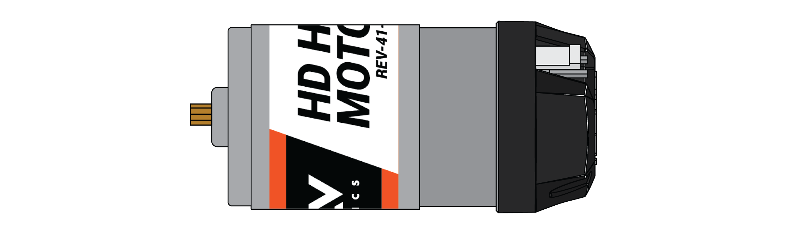
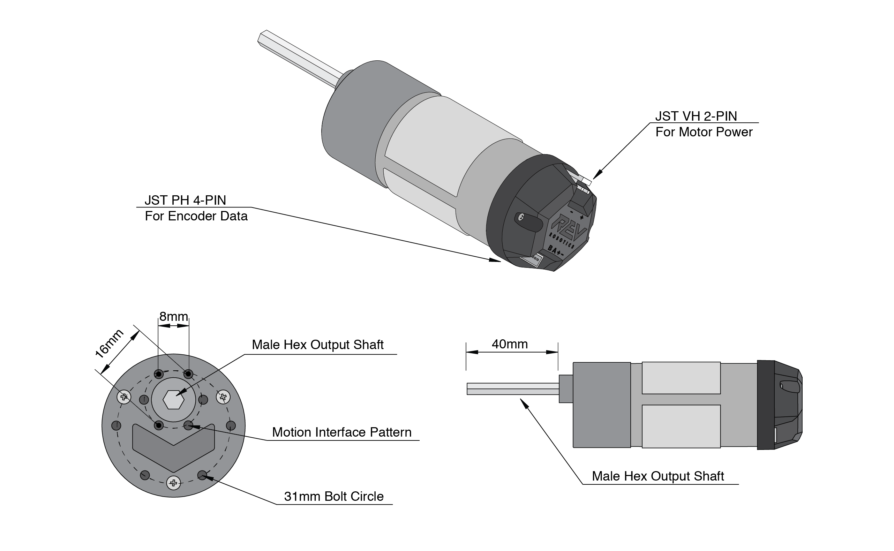

# 40:1 Spur Gearbox (with HD Hex Motor)

40:1 Gearboxes can be used for a variety of applications. While they aren't great as drivetrain motors (because they aren't very fast), they make for great chain drivers.&#x20;

## Construction

The 40:1 motor kit uses a spur gearbox with the HD Hex Motor (not to be confused with the Core Hex Motor).&#x20;


**NOTE**: The HD Hex Motors are not interchangeable between the spur gearboxes and the UltraPlanetary gearboxes. The spur HD Hex Motor variant has a


## Code

The code for the 40:1 motor is fairly standard. Because it uses the same HD Hex Motor at its core as other motors, there is only a need to configure it correctly in the 'Configurations' page (with can be accessed via the phones). It is beneficial to select the '40:1 HD Hex Motor' option on that page so that the Control Hub knows how to effectively apply power to the motor and the encoder can correctly read the data.&#x20;

## [REV Robotics Documentation](https://docs.revrobotics.com/duo-build/actuators/motors/hd-hex-motor#spur-gearboxes)

#### Buy another [here](https://www.revrobotics.com/rev-41-1301/)
