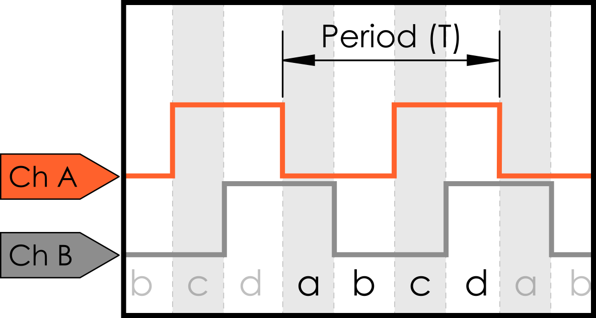

# Motor Encoders

(Information pulled from REV Robotics documentation)

### What is an Encoder?

An encoder is anything (device, software, person) that _converts_ information from one format into another. Some examples of encoding include:&#x20;

* A transducer, like a speaker, which _converts_ an electrical signal into sound waves
* Software which _encodes_ an audio file into an mp3 to decrease file size
* A stenographer (court reporter) takes courtroom dialog and _converts_ it into a written record

This section is about rotary encoders which are electro-mechanical devices which convert the angular position of a shaft, like on a motor, to an electronic signal. These signals can be fed into a microcontroller, which controls all robot functions, and then used to provide real world data to make better programming decisions.

There are two main types of encoders: absolute and relative.

**Absolute encoders** return the actual angle of the rotation (e.g. 30°). Absolute encoders maintain position information if the power is removed, and position data is immediately available when power is reapplied with no rotation needed to read the current angle. The relationship between the encoder value and the motor shaft is set when assembled and will always stay the same. Commonly these encoders use a specially printed pattern disk which are read and converted to a known angle. Generally, absolute encoders are easier to use when programming, but they are more complicated to manufacture so are larger, or more expensive.

**Relative encoders,** which are also referred to as **incremental encoders**, provide information about the motion of the shaft (e.g. forward at 5 RPM), and only provide data while the shaft is rotating. One way to remember this is that relative encoders return information on the incremental change of the motor output shaft. Relative encoders only provide pulses as the motor turns, and interpreting these pulses into useful information must be done externally. A relative encoder does not know what position it is in at start-up, but it is possible to create a calibration program that must be run at every start-up to obtain reference point to calculate an angle from.

Encoders measure a real world change (shaft rotation) and convert it to an electrical signal. Two common ways to do this are using optical or magnetic feedback:

**Optical encoders** have a disk with a series of either slots or a reflective pattern around the outside which is attached to the motor shaft. A light shines on or through the disk where the light can pass through or reflect onto a photodiode (device which produces an electric signal when light shines on it). These sensors can be very light and compact, but can be very sensitive to anything that might interfere with the light reaching the photodiode. Finger prints on a reflective disk, or dust from a dirty environment can interfere.

**Magnetic encoders** have a magnet attached to the shaft of a motor and use Hall effect sensors to detect the changing magnetic field as the shaft rotates. Magnetic encoders are able to operate in harsh or dirty environments.

### Magnetic Quadrature Encoders

A 12 pole magnetic quadrature encoder is installed on the rear of both the HD Hex Motor and Core Hex Motor. The output shaft of the motor extends from the rear of the motor case and a multi-pole permanent magnet is attached to the shaft. There are two Hall effect sensors, marked ‘A’ and ‘B’, mounted next to the magnet at 90° to each other. As each of the 12 poles passes across one of the Hall effect sensors, it creates a change in the magnetic field causing the sensor to generate a measurable voltage signal.

Quadrature encoders are a specific type of relative encoder that have four different output states. If the root _quad-_, means four, but there are only two sensors in this encoder, where does the name come from? The output from the two Hall effect sensors are called “Channel A” and Channel B” respectively; an example of the output is shown below. In a single period (T), defined as the duration of time of one complete cycle in a repeating pattern, the timing diagram has four distinct states (see a, b, c, and d below), hence a quadrature encoder.

The offset from Channel A to Channel B is because the sensors are offset from each other by 90°. As the motor rotates one sensor will see the change before the other. When the motor shaft rotates clockwise (CW), Channel A will lead (the edge will rise before) Channel B. When the motor spins counter clockwise (CCW) Channel A will lag (rise after) Channel B. If there was only one sensor it would still be possible to measure the number of rotations, but not to detect the direction of the motor.


On HD Hex and Core Hex motors Channel A leads Channel B when positive voltage is applied to the M+ terminal. However, there are times when this will not hold true in real life. Different reduction gearboxes, or physically swapping the Channel A and Channel B encoder wires into the controller, can reverse the relationship between the channels. Keep this in mind when programming and troubleshooting your robot.


When the encoder is being read by a microcontroller, the two signals are compared to produce a count up pulse or count down pulse. These pulses are counted as steps forward (CW) or backwards (CCW). Using the specifications for the encoder being used, a count can be converted to degrees. This information can be used to drive a robot arm to a specific angle, or tell a robot to drive a certain distance. Both the Control Hub and Expansion Hub communicate to a microcontroller through the encoder ports.

### Encoder Technical Specification Definitions 


There is some conflicting terminology difference between encoder suppliers. This document defines one of the most commonly agreed upon set of terms, however be aware that when comparing between encoder specifications from different vendor’s terms may vary in meaning.


Every time the output goes through all four distinct combinations of output signals, it’s called a **cycle** (see a, b, c, and d below). Encoders have a different **cycles-pre-revolution(CPR)** based on the number of poles on the magnet used. The CPR is how many cycles are generated for one complete revolution of the encoder shaft.

An example output from one complete rotation of a 14 CPR encoder is shown in in the figure below. A 14 CPR rotation encoder may also be referred to as having 14 rises on channel A. Encoders are mounted to the motor shaft, not the gearbox output shaft, so for a motor with a reduction gearbox attached this is less than one full output shaft rotation.

One reason to use CPR to define an encoder, rather than the commonly used PPR (Pulses per Revolution) is when the encoder signal is decoded by the microcontroller it is possible to do 1x, 2x, or 4x decoding. For 1x decoding the micro controller would only “count” the rising signal on a single channel, while for 4x decoding each rising or falling edge for both channels is measured as a “count.” Although 4x decoding is one of the most common methods, because it’s based on how the electronics decode the signal from the encoder, and not on the encoder hardware itself, it’s not an ideal method of defining the encoder hardware specifications.If we assume 4x decoding when each cycle is interpreted, the microcontroller can read the four distinct outputs (a, b, c, and d) as individual steps. So for each CPR, the controller can read four counts/ticks. To calculate the number of counts per rotation of the encoder shaft:

`COUNTSPERROTATION(oftheencodershaft)=CPR(Cyclesperrotation)×4COUNTSPERROTATION(​oftheencodershaft)=CPR(Cyclesperrotation)×4`

The actual cycles per rotation of the output shaft of the motor is depending on the gearbox that’s attached.

`COUNTSPERROTATION(oftheoutputshaft)=CPR(Cyclesperrotation)×4×ReductionCOUNTSPERROTATION(​oftheoutputshaft)=CPR(Cyclesperrotation)×4×Reduction`

This can be calculated into the degrees per count. Assuming no additional reduction is added to the final stage of the motor output (i.e. direct drive) the number of degrees per count is calculated as:

`DEGREESPERCOUNT=360°/COUNTSPERROTATION(oftheoutputshaft)DEGREESPERCOUNT=360°/COUNTSPERROTATION(​oftheoutputshaft)`

### [REV Robotics Documentation](https://docs.revrobotics.com/duo-control/sensors/encoders)

### [REV Robotics Encoder Specifications](https://docs.revrobotics.com/duo-control/sensors/encoders/motor-based-encoders)
