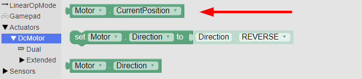
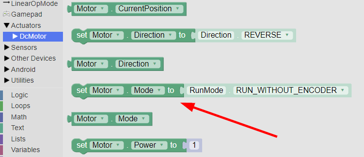
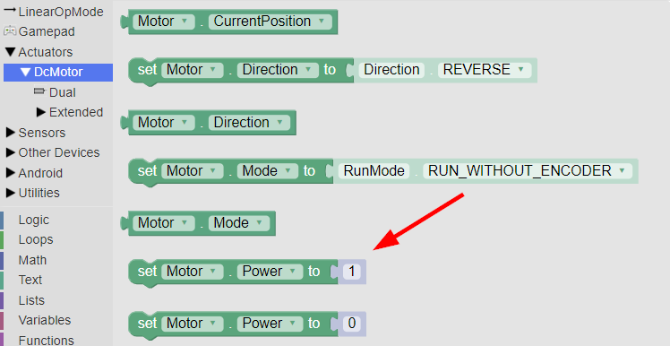
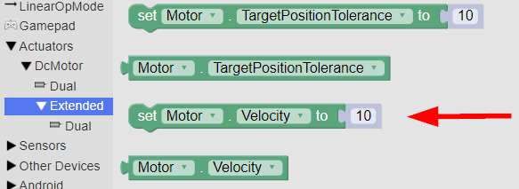
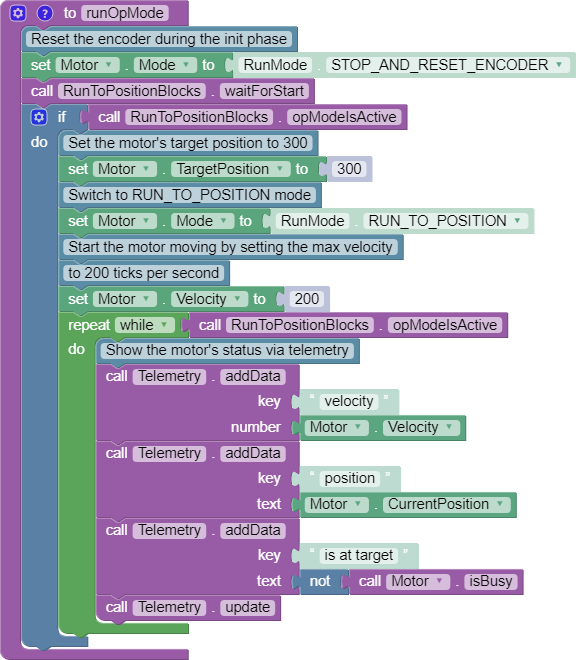
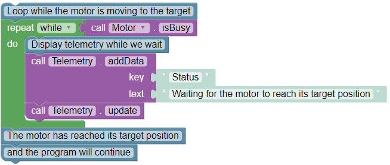

# Encoder Code

Encoders are used to measure the rotational travel of a motor. When combined with some simple math, encoders can be used to measure the degrees rotated of a motor, the distance traveled of a robot, or even identify potential failures.

## Basic Encoder Concepts

Each motor designed by REV has an encoder built into it that keeps track of its rotation. To use it, you must have a [4-pin JST PH](broken-reference) cable connecting the motor to the Control Hub ([REV-31-1595](https://www.revrobotics.com/rev-31-1595/)) or Expansion Hub **** ([REV-31-1153](https://www.revrobotics.com/rev-31-1153/)), next to the [2-pin JST VH](broken-reference) cable used to provide power to the motor.

Encoder values are measured in “ticks.” Different motors have different numbers of ticks per rotation of the output shaft based on the gear ratio of the motor. When the Control Hub is turned on, all of its encoder ports are at 0 ticks. As a motor moves forward, its encoder value increases. As a motor moves backwards, its encoder value decreases.&#x20;

For more information see the [section on encoders](broken-reference).

## Choosing a Motor Mode

Your programs can always access the encoder values directly, but you can also direct the Control Hub to use the encoder values to maintain a motor’s speed, or maintain a particular position. You do this by changing the motor’s mode.


It is recommended to use the latest Control Hub and Expansion Hub firmware before using RUN\_USING\_ENCODER mode or RUN\_TO\_POSITION mode.


### STOP\_AND\_RESET\_ENCODER Mode

Place a motor in this mode when you want to set its encoder position back to 0. The motor will stop. To start it again, you need to place the motor into one of the other three modes. It is recommended to place each motor you will be using encoders with into this mode at the start of each program, so that you know what position the motor is starting out in.

### RUN\_WITHOUT\_ENCODER Mode

Use this mode when you don’t want the Control Hub to attempt to use the encoders to maintain a constant speed. You can still access the encoder values, but your actual motor speed will vary more based on external factors such as battery life and friction. In this mode, you provide a power level in the -1 to 1 range, where -1 is full speed backwards, 0 is stopped, and 1 is full speed forwards. Reducing the power reduces both torque and speed.&#x20;


This mode is a good choice for drivetrain motors driven by joysticks on the gamepad.


### RUN\_USING\_ENCODER Mode

In this mode, the Control Hub will use the encoder to take an active role in managing the motor’s speed. Rather than directly applying a percentage of the available power, RUN\_USING\_ENCODER mode targets a specific velocity (speed). This allows the motor to account for friction, battery voltage, and other factors.


This mode is a good choice for operations, like a flywheel, that require a specific speed and can use buttons on a gamepad for control.


### RUN\_TO\_POSITION Mode

In this mode, the Control Hub will target a specific position, rather than a specific velocity. You still set a velocity, but it is only used as the maximum velocity. The motor will continue to hold its position even after it has reached its target.


This mode is a good choice for operations, like an arm, that require a specific position and can use buttons on a gamepad for control.


## Reading the Encoder Value



In Blocks, you access the current encoder value by using the DcMotor CurrentPosition block.





In Java, you access the current encoder value by calling `getCurrentPosition()` on a DcMotor or DcMotorEx object. This sample program prints the encoder value for a motor configured with the name “Motor” to telemetry:

```
package org.firstinspires.ftc.teamcode;
// import lines were omitted. OnBotJava will add them automatically.
​
@TeleOp
public class JavaEncoderTest extends LinearOpMode {
    DcMotorEx motor;
    
    @Override
    public void runOpMode() {
        motor = hardwareMap.get(DcMotorEx.class, "Motor");
        waitForStart();
        while (opModeIsActive()) {
            telemetry.addData("Encoder value", motor.getCurrentPosition());
            telemetry.update();
        }
    }
}
```



## Setting the Motor Mode



In Blocks, you set the motor’s mode with this block. You can select different modes from its dropdown menu.





Here is a snippet of code that demonstrates how to do the same thing in Java. You can skip the first line if you already have retrieved the motor object from hardwareMap. Change RUN\_WITHOUT\_ENCODER to the desired motor mode (STOP\_AND\_RESET\_ENCODER, RUN\_WITHOUT\_ENCODER, RUN\_USING\_ENCODER, or RUN\_TO\_POSITION).

```java
DcMotorEx motor = hardwareMap.get(DcMotorEx.class, "Motor");
motor.setMode(DcMotor.RunMode.RUN_WITHOUT_ENCODER);
```



## Using RUN\_WITHOUT\_ENCODER

The RUN\_WITHOUT\_ENCODER motor mode is very straightforward, you simply set a power in the range of -1.0 to 1.0. However, if you try to set a velocity (which will be covered later on), the motor will automatically be switched into RUN\_USING\_ENCODER mode.



The power level is set in Blocks mode using this block:





The power level is set in Java by calling `setPower()` on a DcMotor or DcMotorEx object, as is shown in this snippet. You can skip the first two lines if you already have retrieved the motor object from hardwareMap and set the mode to RUN\_WITHOUT\_ENCODER.

```java
DcMotorEx motor = hardwareMap.get(DcMotorEx.class, "Motor");
motor.setMode(DcMotor.RunMode.RUN_WITHOUT_ENCODER);
// This will run the motor forward at half-power
double motorPower = 0.5;
motor.setPower(motorPower);
```



## Using RUN\_USING\_ENCODER

In RUN\_USING\_ENCODER mode, you should set a velocity (measured in ticks per second), rather than a power level. You can still provide a power level in RUN\_USING\_ENCODER mode, but this is not recommended, as it will limit your target speed significantly. Setting a velocity from RUN\_WITHOUT\_ENCODER mode will automatically switch the motor to RUN\_USING\_ENCODER mode. You should pick a velocity that the motor will be capable of reaching even with a full load and a low battery.



Providing a velocity is an extended motor feature, which means that the block for it is located under DcMotor > Extended. You can see it here:





The velocity is set in Java by calling `setVelocity()` on a DcMotorEx object, as is shown in this snippet. You can skip the first two lines if you have already retrieved the motor object as a DcMotorEx from hardwareMap and set the mode to RUN\_USING\_ENCODER.

```java
DcMotorEx motor = hardwareMap.get(DcMotorEx.class, "Motor");
motor.setMode(DcMotor.RunMode.RUN_USING_ENCODER);
// This will turn the motor at 200 ticks per second
double motorVelocity = 200;
motor.setVelocity(motorVelocity);
```



## Using RUN\_TO\_POSITION

To use RUN\_TO\_POSITION mode, you need to do the following things in this order:

1. Set a target position (in ticks)
2. Switch to RUN\_TO\_POSITION mode
3. Set the maximum velocity

You should reset the encoders (switch to STOP\_AND\_RESET\_ENCODER mode) during initialization when you use RUN\_TO\_POSITION mode. If you are using it with a mechanism such as a lift, you have to be careful to make sure that you always have the motor in the same physical location when you reset the encoders, or else your target position won’t mean the same thing between runs.

The motor will continue to hold its position even after it has reached its target, unless you set the velocity or power to zero, or switch to a different motor mode.

The following examples assume that the motor used is a Core Hex Motor. If it is a motor that has a more precise encoder, such as an HD Hex Motor, higher velocity and target position values will be more appropriate.



Here is a complete Blocks program that uses RUN\_TO\_POSITION.



If you want to wait for the motor to reach its target position before continuing in your program, you can use a while loop that checks if the motor is busy (not yet at its target):





```java
package org.firstinspires.ftc.teamcode;
// import lines were omitted. OnBotJava will add them automatically.

@TeleOp
public class JavaRunToPositionExample extends LinearOpMode {
    DcMotorEx motor;
    
    @Override
    public void runOpMode() {
        motor = hardwareMap.get(DcMotorEx.class, "Motor");
        
        // Reset the encoder during initialization
        motor.setMode(DcMotor.RunMode.STOP_AND_RESET_ENCODER);
 
        waitForStart();
        
        // Set the motor's target position to 300 ticks
        motor.setTargetPosition(300);
        
        // Switch to RUN_TO_POSITION mode
        motor.setMode(DcMotor.RunMode.RUN_TO_POSITION);
        
        // Start the motor moving by setting the max velocity to 200 ticks per second
        motor.setVelocity(200);
 
        // While the Op Mode is running, show the motor's status via telemetry
        while (opModeIsActive()) {
            telemetry.addData("velocity", motor.getVelocity());
            telemetry.addData("position", motor.getCurrentPosition());
            telemetry.addData("is at target", !motor.isBusy());
            telemetry.update();
        }
    }
}
```

If you want to wait for the motor to reach its target position before continuing in your program, you can use a while loop that checks if the motor is busy (not yet at its target):

```java
// Loop while the motor is moving to the target
while(motor.isBusy()) {
 // Let the drive team see that we're waiting on the motor
 telemetry.addData("Status", "Waiting for the motor to reach its target");
 telemetry.update();
}
// The motor has reached its target position, and the program will continue
```



## [REV Robotics Encoder Code Docs](https://docs.revrobotics.com/duo-control/programming/using-encoder-feedback)
