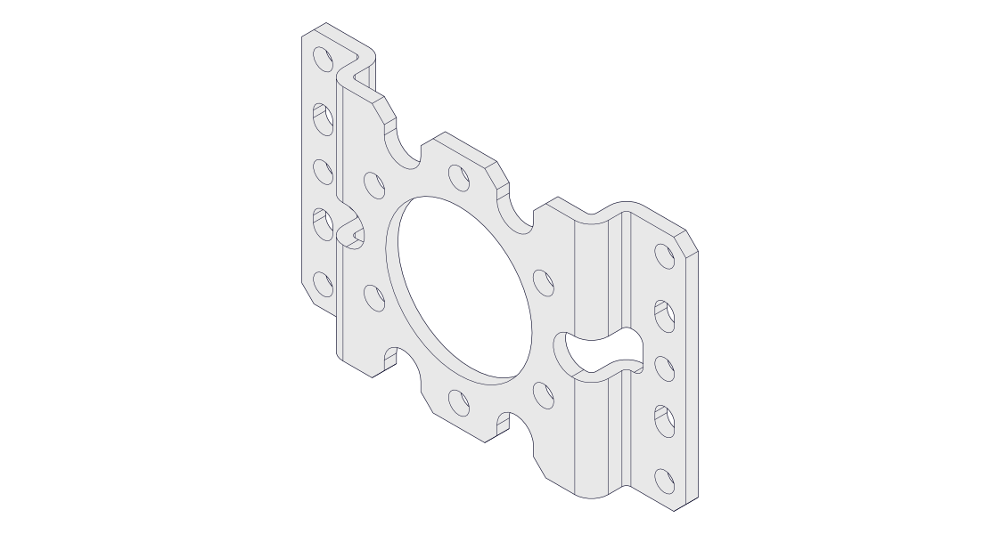
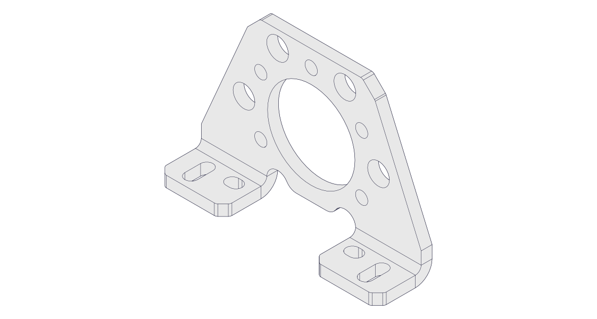
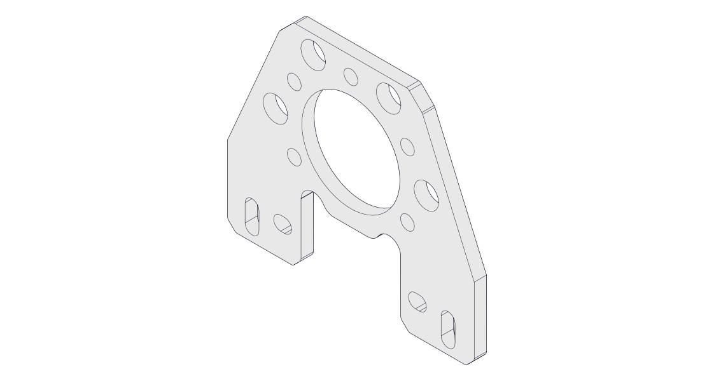
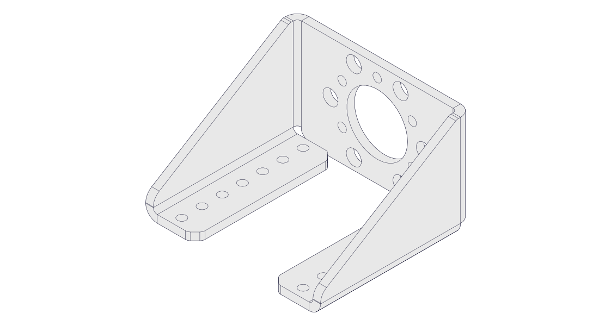

# UltraPlanetary HD Gearing (with Hex Motor)

 

### Explanation

UltraPlanetary gearing allows motor to immediately feed into gearing in a compact manner. When attached, UltraPlanetary gears grant greater torque at the expense of rotational speed. For example, if a 5:1 gear is placed in the motor assembly, the shaft will only rotate once for every five rotations of the motor. The motor will be 1/5 as fast, but have 5x the torque (think of it as 5x as strong).

Often, multiple gears will be placed on top of each other in the assembly to multiply the torque factor. For example, if one placed a 5:1 on the motor, then a 3:1 on the 5:1, the overall ratio would be 15:1. The motor will go 1/15th the speed, but will be 15x stronger.

#### Example Uses

* Drivetrain motors (5:1)
* Arm extension motors (20:1 or more)

#### [Links to Parts](https://docs.revrobotics.com/ultraplanetary/)

### Assembly Instructions

<table><thead><tr><th data-type="files">Images</th><th></th></tr></thead><tbody><tr><td></td><td>
Attach the UltraPlanetary Mounting Plate to the HD Hex Motor using two 8mm Button Head Screws. 

<strong>Note:</strong> Use the 2mm Allen Key to tighten these screws.
</td></tr><tr><td></td><td>
Seat the UltraPlanetary Cartridge onto the input pinion. 

<strong>Note:</strong> Placing a finger on the output of the Cartridge and turning it helps for placement.
</td></tr><tr><td></td><td>Add however many UltraPlanetary Cartridges as needed onto the previous UltraPlanetary Cartridge.</td></tr><tr><td></td><td>Seat the UltraPlanetary Output Stage onto the last UltraPlanetary Cartridge.</td></tr><tr><td></td><td>
Insert six of the 30mm Cap Head Screws into the holes in the outer ring off the Output Cartridge.

Tighten these screws down until they are snug not tight using a 2.5mm allen wrench. 

<strong>Note:</strong> The 30mm length is the 2nd longest screw provided with the UltraPlanetary Gearbox Kit.
</td></tr><tr><td></td><td>Align the UltraPlanetary Outside Mounting Bracket with the mounting holes on the Output Cartridge.</td></tr><tr><td></td><td>
Insert six 8mm Hex Cap Screws into the mounting holes.

Tighten the screws until they are snug.
</td></tr><tr><td></td><td><strong>ULTRAPLANETARY ASSEMBLY COMPLETE</strong></td></tr></tbody></table>

#### [REV Robotics Assembly Instructions](https://docs.revrobotics.com/duo-build/channel-drivetrain-build-guide/ultraplanetary-gearbox-assembly)

### Supported Mounting Brackets

   

### [Cartridge Details](https://docs.revrobotics.com/ultraplanetary/ultraplanetary-gearbox/cartridge-details)

### [Load Ratings](https://docs.revrobotics.com/ultraplanetary/ultraplanetary-gearbox/load-ratings)
