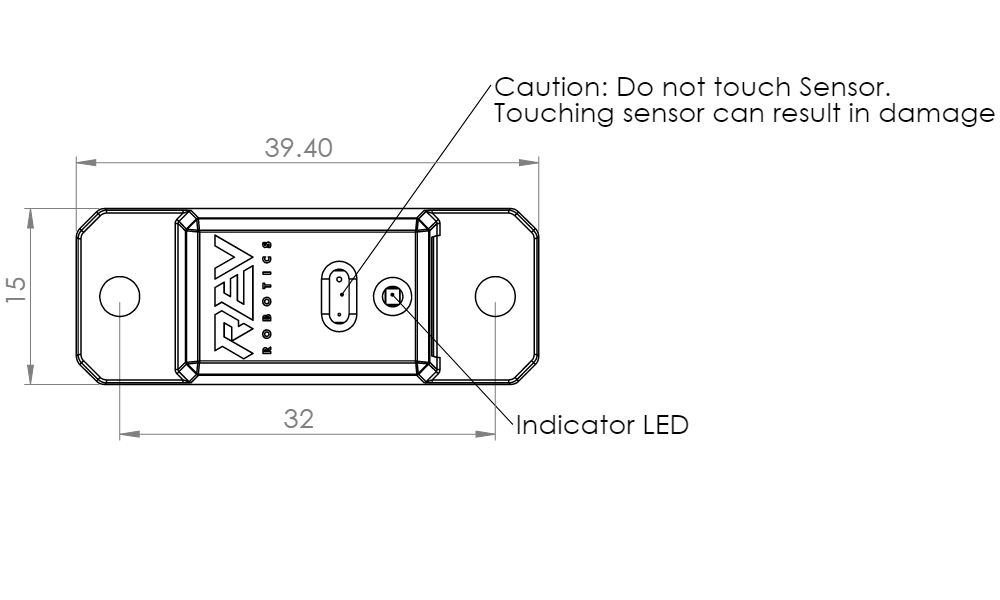

# ↔ 2m Distance Sensor

.png>)

The 2m Distance Sensor uses a laser-ranging module to measure distances up to 2m with millimeter resolution. The sensor uses the I2C interface to communicate with the Control Hub.&#x20;

## Specifications




## Code Example


* The Distance Sensors uses the [I2C ](external-i2c-devices.md)interface with an address of `0x52.`
* The operating voltage range is 3.3V - 5V.
* The read distance will be between 5 cm and 200 cm.


#### Configuring in the Control System&#x20;

Configure the 2m Distance Sensor as "REV 2M Distance Sensor," shown in the image below.&#x20;



The Robot Controller Application currently only supports the default profile for the sensor.


In this example, the 2m Distance Sensor is configured on I2C bus 1.


Recall that I2C sensors must have different addresses in order to operate on the same bus. The Color Sensor V3 and 2m Distance Sensor share the same address.&#x20;


#### Programming Applications

This program moves a motor if there is an object less than 10 centimeters from the distance sensor, and stops it if there is no object within that range.








The Java version of this program is pasted below. It assumes that the Distance Sensor was configured with the name “Distance” and that a motor was configured with the name “Motor.”


```java
package org.firstinspires.ftc.teamcode;
 
import com.qualcomm.robotcore.eventloop.opmode.TeleOp;
import com.qualcomm.robotcore.hardware.DcMotor;
import org.firstinspires.ftc.robotcore.external.navigation.DistanceUnit;
import com.qualcomm.robotcore.hardware.DistanceSensor;
import com.qualcomm.robotcore.eventloop.opmode.LinearOpMode;
 
@TeleOp
public class DistanceTest extends LinearOpMode {
    DistanceSensor distance;
    DcMotor motor;
    
    @Override
    public void runOpMode() {
        // Get the distance sensor and motor from hardwareMap
        distance = hardwareMap.get(DistanceSensor.class, "Distance");
        motor = hardwareMap.get(DcMotor.class, "Motor");
        
        // Loop while the Op Mode is running
        waitForStart();
        while (opModeIsActive()) {
            // If the distance in centimeters is less than 10, set the power to 0.3
            if (distance.getDistance(DistanceUnit.CM) < 10) {
                motor.setPower(0.3);
            } else {  // Otherwise, stop the motor
                motor.setPower(0);
            }
        }
    }
}

```



## [REV Robotics Documentation](https://docs.revrobotics.com/2m-distance-sensor/)
