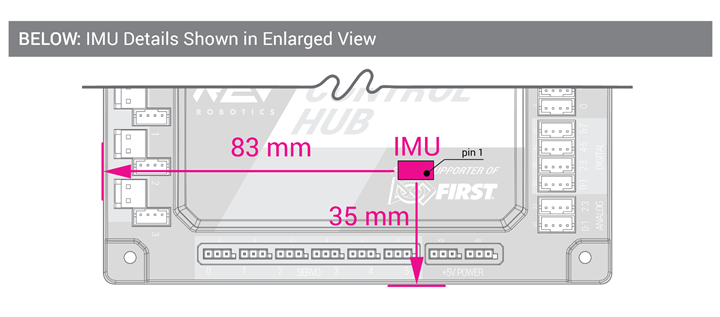

# BNO055 IMU (Inertial Measurement Unit)

There is already an absolute orientation sensor built-in to the robot. It uses the I2C interface to read/write data to the robot.&#x20;

You can add more of these sensors by connecting each additional one to an I2C port and obtaining the address.&#x20;

### Accessing the Built-in Sensor



1. The internal address of this sensor is `0x28` on port 0
2. Run the following code to connect to the sensor and read data off of it.

```
// Connecting to internal I2C
```

### Connecting Additional Sensors

Additional IMU's can be added via the I2C ports on the right side of the Control Hub.&#x20;

* (For more information about connections, refer to the pinout)


[control-hub-specifications.md](../../ftc-setup-documentation/control-hub-specifications.md)


#### Wiring

#### Device Search

#### Reading Data from IMU
