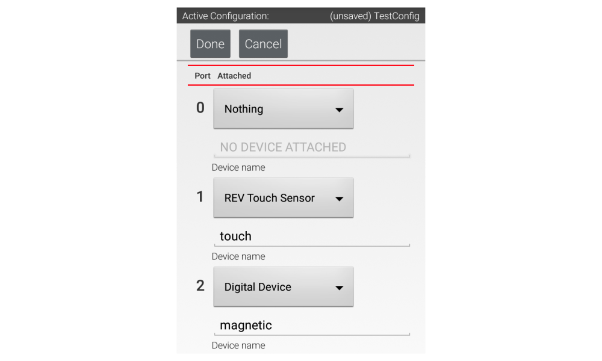
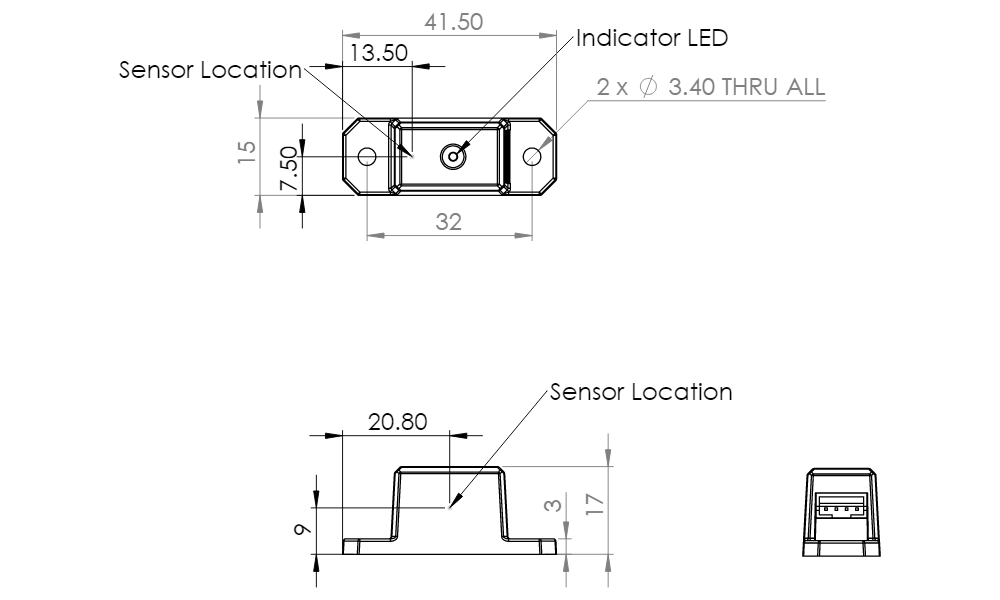
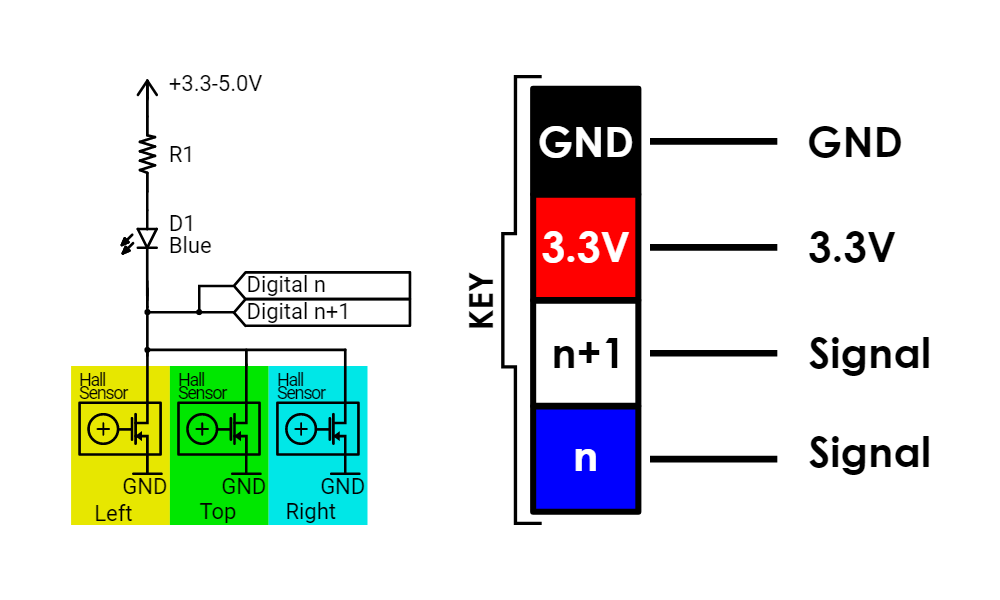

# 🧲 Magnetic Limit Switch


The Magnetic Limit Switch is a digital sensor (details below). It detects magnetic fields through hall effect sensors embedded within the housing of the sensor. To trigger the sensor, simply position a magnet close to the sensor.&#x20;

## Example Code

### Configuration

The Magnetic Limit Switch can be configured as "REV Touch Sensor" or as "Digital Device" as shown in the image below.&#x20;




_**Digital Interface Explanation**_

In this example, the Touch Sensor is configured on port 2. It is touched on briefly in the [Pinout Section ](broken-reference)that the Magnetic Limit Switch is capable of sending a signal to the Control Hub through the n+1 and n communication channels. The channel the sensor communicates through is decided by which port it is configured on. In this case, the Magnetic Limit Switch communicates through the n channel.&#x20;


### Code

The code blocks below gives a basic example of how to use the Magnetic Limit Switch to limit the motion range of a motor using if/else logic. If the magnet is within range of the sensor then the motor stops. Otherwise the motor is allowed to move. When triggered by proximity to a magnet, the sensor is considered **pressed**.&#x20;



.png)




The code assumes the sensor has been named "Limit" and the motor has been named "Motor" in configuration.&#x20;


```java
package org.firstinspires.ftc.teamcode;
 
import com.qualcomm.robotcore.eventloop.opmode.LinearOpMode;
import com.qualcomm.robotcore.hardware.TouchSensor;
import com.qualcomm.robotcore.eventloop.opmode.TeleOp;
import com.qualcomm.robotcore.hardware.DcMotor;
 
@TeleOp
public class TouchTest extends LinearOpMode {
    // Define variables for our touch sensor and motor
    TouchSensor touch;
    DcMotor motor;
 
    @Override
    public void runOpMode() {
        // Get the touch sensor and motor from hardwareMap
        limit = hardwareMap.get(TouchSensor.class, "Limit");
        motor = hardwareMap.get(DcMotor.class, "Motor");
        
        // Wait for the play button to be pressed
        waitForStart();
 
        // Loop while the Op Mode is running
        while (opModeIsActive()) {
            // If the Magnetic Limit Swtch is pressed, stop the motor
            if (limit.isPressed()) {
                motor.setPower(0);
            } else { // Otherwise, run the motor
                motor.setPower(0.3);
            }
            
        telemetry.addData("Arm Motor Power:", motor.getPower());
        telemetry.update();
            }
    }
```



## Specifications

### Sensor Dimensions



### Magnet Dimensions


### Pinout and Electrical Structure



## [REV Robotics Documentation](https://docs.revrobotics.com/magnetic-limit-switch/)
