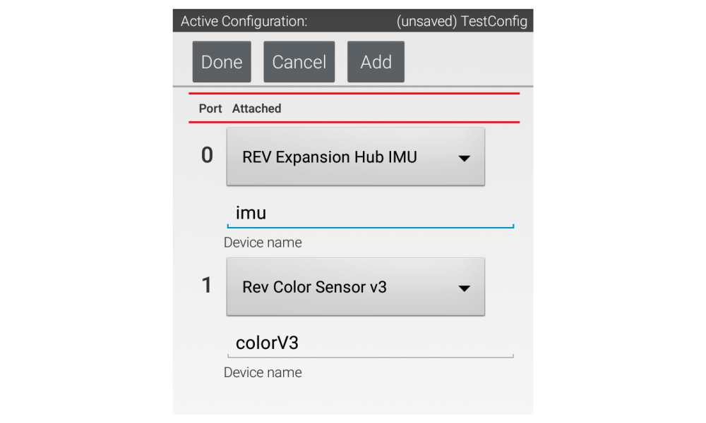
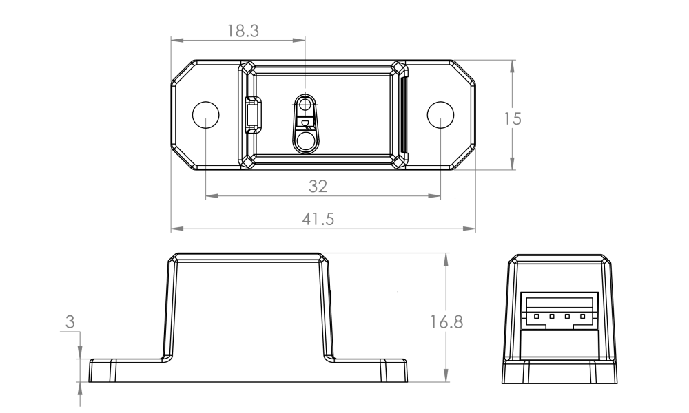

# 🚥 REV Color Sensor (v3)


The Color sensor is a digital sensor (it utilizes the I2C interface) that can detect light levels, ranges or color (RGB values), and--to a certain extent--distance.&#x20;


Color measurements consist of Red, Green, Blue, and Alpha (clear) values. The white LED on the sensor has a slide switch to turn the LED on or off. Unlit targets are best illuminated with the build-in LED while bright or light-emitting targets may not require the build-in LED. Color data is best collected within 2cm of the target for the strongest color differentiation.



Proximity measurements are based on IR reflectance and can vary depending on lighting conditions and target reflectivity. The proximity sensor is ideally used to determine if something is in front of the sensor. While you can receive rough distance data, we recommend using the [2m Distance Sensor](http://www.revrobotics.com/rev-31-1505/) or similar time-of-flight sensor for accurate distance measurement.


## Example Code

### Configuration for the Control System


**Note to users transitioning from Color Sensor V2 to V3:** Color values will not be consistent between V2 and V3 sensors and there are minor changes to the FTC SDK. If working with Android Studio, be sure to update to the latest SDK.


When working with the Color Sensor V3 configure your robot to use the "REV Color Sensor V3" as shown in the image below. &#x20;



In this example, the Color Sensor V3 is configured on I2C bus 0. The Color Sensor V3 can be configured on any of the I2C busses as long as a 2m Distance Sensor is not configured to the same bus.


Recall that I2C sensors must have different addresses in order to operate on the same bus. The Color Sensor V3 and 2m Distance Sensor share the same address.&#x20;


### Programming Example&#x20;

This program shows the values from the Color Sensor on your phone. Your team will need to figure out the logic to use this information in your program. Below there are three examples of different color modes and their readings. Light Detected mode will read the amount of light on the sensor from 0-1.0. Because the sensor is close to a surface, the LED in the sensor reads 1.0 in the examples.








The code assumes that the Color Sensor was configured with the name “Color.”


```java
package org.firstinspires.ftc.teamcode;
 
import com.qualcomm.robotcore.eventloop.opmode.LinearOpMode;
import com.qualcomm.robotcore.hardware.ColorSensor;
import com.qualcomm.robotcore.eventloop.opmode.TeleOp;
 
@TeleOp
public class TestColorSensor extends LinearOpMode {
    // Define a variable for our color sensor
    ColorSensor color;
    
    @Override
    public void runOpMode() {
        // Get the color sensor from hardwareMap
        color = hardwareMap.get(ColorSensor.class, "Color");
        
        // Wait for the Play button to be pressed
        waitForStart();
 
        // While the Op Mode is running, update the telemetry values.
        while (opModeIsActive()) {
            telemetry.addData("Red", color.red());
            telemetry.addData("Green", color.green());
            telemetry.addData("Blue", color.blue());
            telemetry.update();
        }
    }
}

```



## Specifications




​When using the Color Sensor V3 on the I2C Interface, you will need to make sure that the voltage is set to **3.3V**. The Color Sensor V3 has a max operating voltage of 3.3V and applying 5V can damage the sensor.&#x20;


## [REV Robotics Documentation](https://docs.revrobotics.com/color-sensor/)
