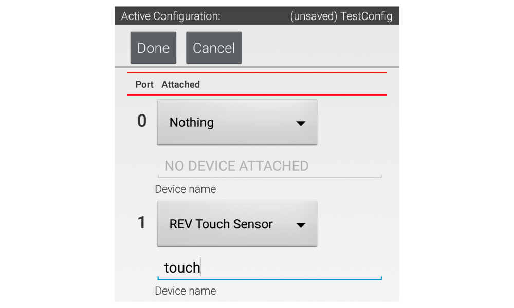
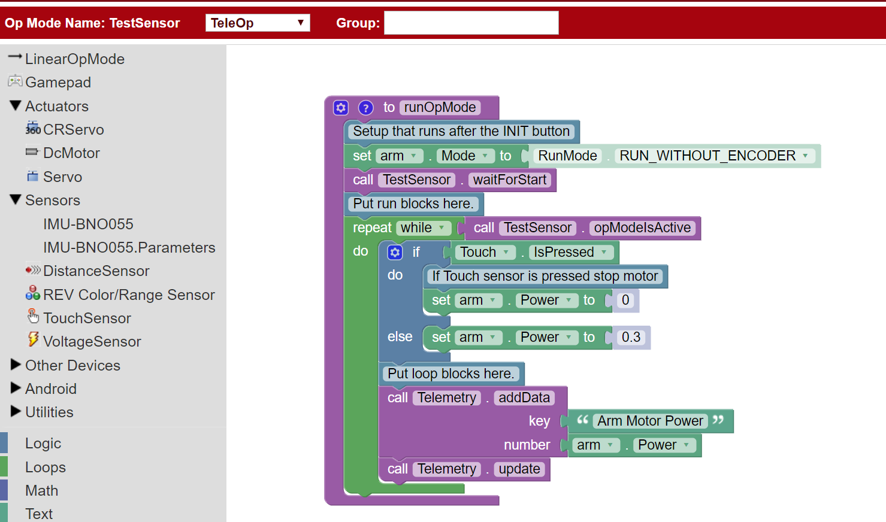
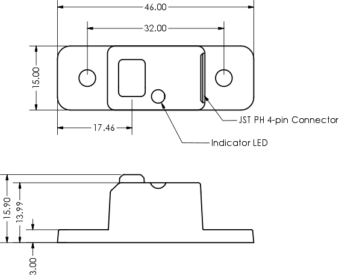

# 👆 REV Touch Sensor


Like all digital sensors, the Touch Sensor acts on a binary. When the button is not pressed, the LED light remains unlit and the value read by the Hub is 3.3V (high) and when the button is pressed the LED will light and the Hub will read 0V (low). In the code, the button will return '0' if not pressed and '1' if pressed.

### Example Code

The code below runs a motor while the button has not been pressed.


The code assumes the sensor has been named "Touch" and the motor has been named "Motor" in configuration.&#x20;










```
import com.qualcomm.robotcore.hardware.TouchSensor;
import com.qualcomm.robotcore.eventloop.opmode.TeleOp;
import com.qualcomm.robotcore.hardware.DcMotor;
 
@TeleOp
public class TouchTest extends LinearOpMode {
    // Define variables for our touch sensor and motor
    TouchSensor touch;
    DcMotor motor;
 
    @Override
    public void runOpMode() {
        // Get the touch sensor and motor from hardwareMap
        touch = hardwareMap.get(TouchSensor.class, "Touch");
        motor = hardwareMap.get(DcMotor.class, "Motor");
        
        // Wait for the play button to be pressed
        waitForStart();
 
        // Loop while the Op Mode is running
        while (opModeIsActive()) {
            // If the touch sensor is pressed, stop the motor
            if (touch.isPressed()) {
                motor.setPower(0);
            } else { // Otherwise, run the motor
                motor.setPower(0.3);
            }
        }
    }
```



### Mechanical Specifications



### [REV Robotics Documentation](https://docs.revrobotics.com/touch-sensor/)
