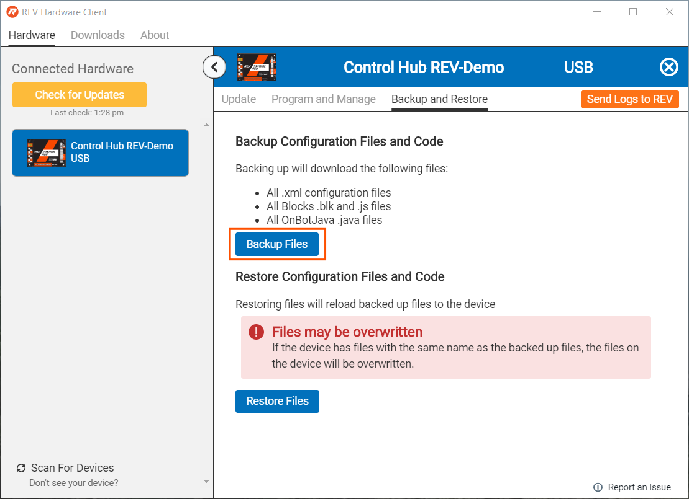
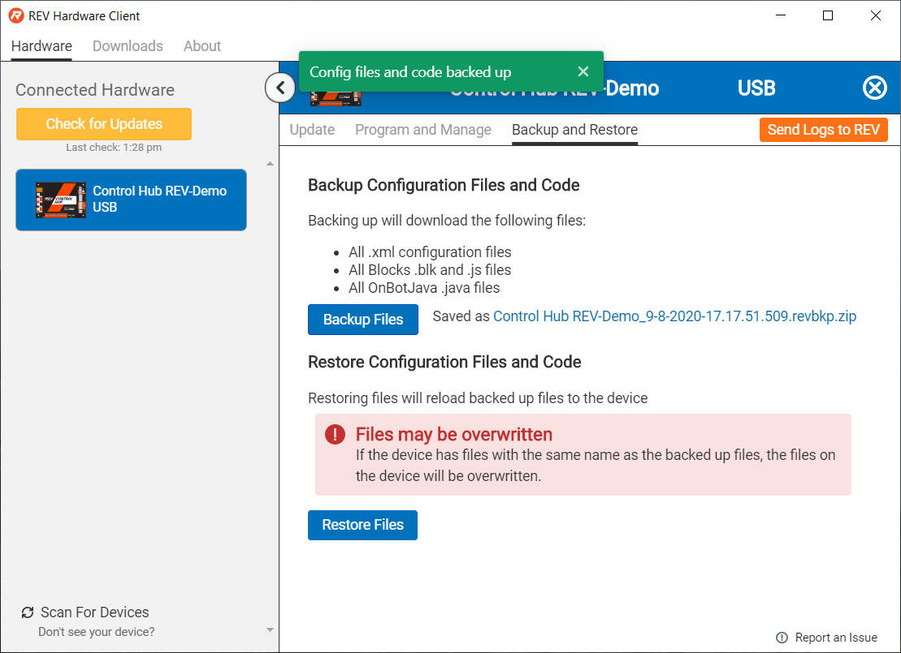
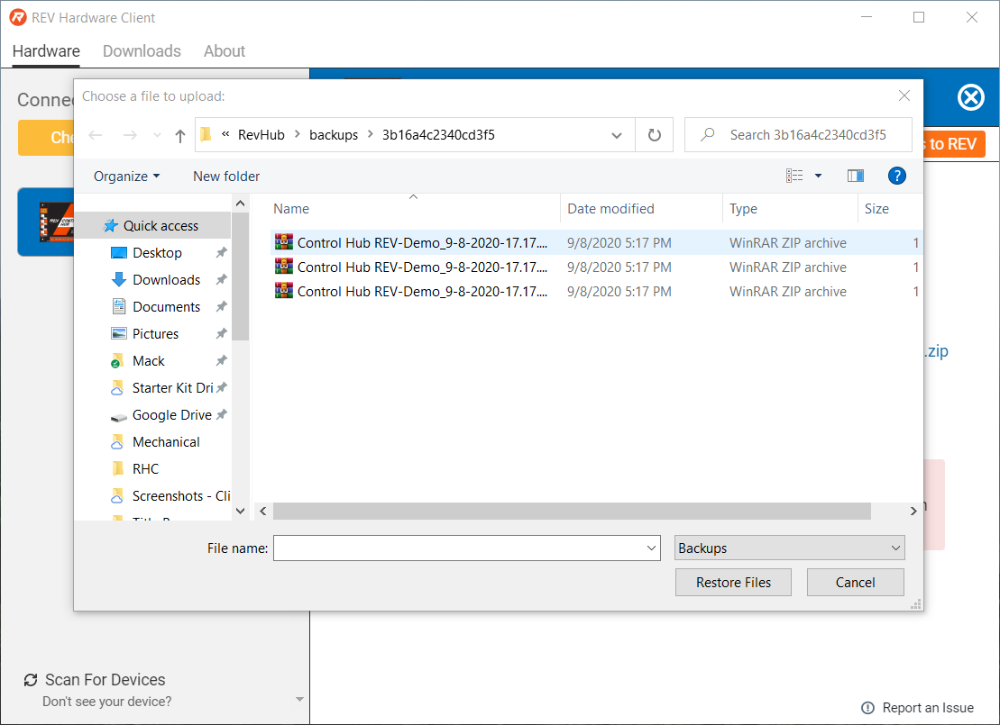
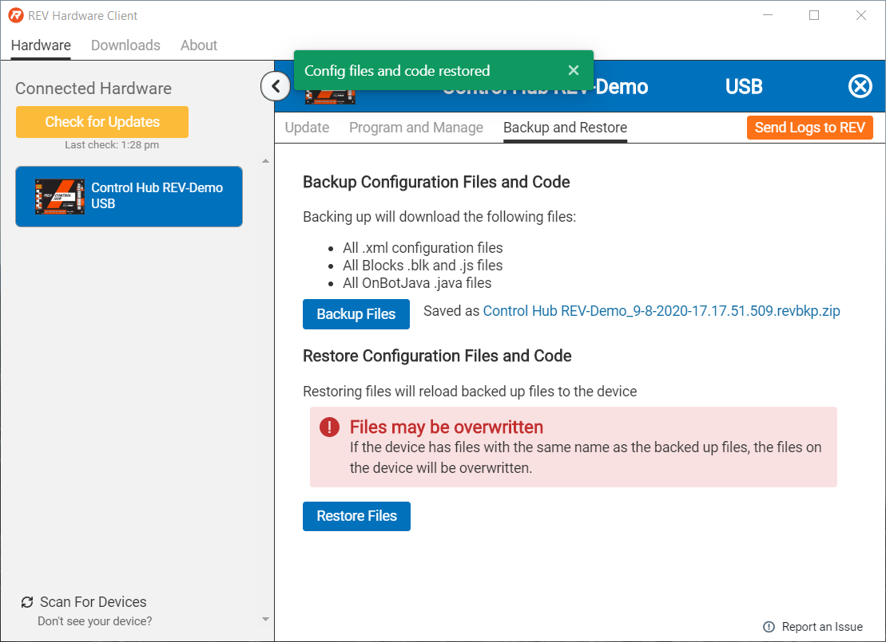

# Restoring User Data

## Backup Files

Once on the Backup and Restore Tab, select the Backup Files button.

Once selected a prompt will display confirming Configuration Files and Robot Code are backed up. Also, the zip file name is visible.

## Restoring Files

To Restore Files, select the Restore Files button.

Once selected, a window opens prompting you to select the zip file to restore. Select the zip file and press Restore Files.

Once selected the Client will prompt with the Configuration Files and Robot Code are restored.

