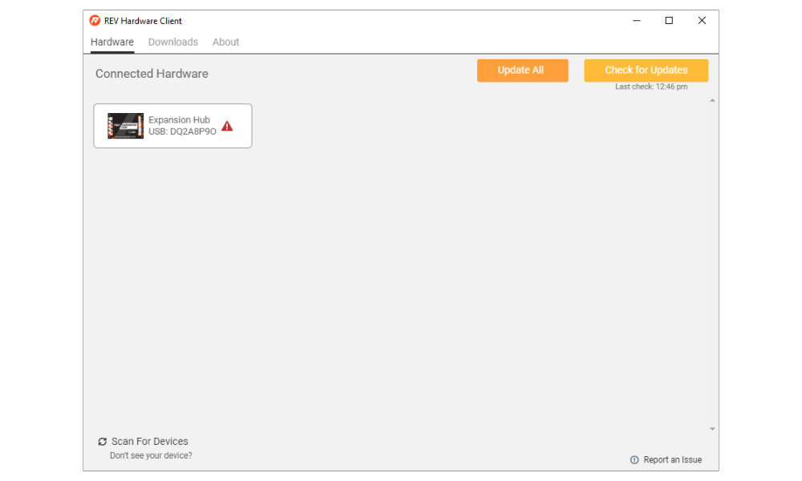

# Updating Expansion Hub

The Expansion Hub facilitates a line of communication between a connected Robot Controller and the motors, servos, and sensors. In order to improve the quality of the Hub, REV Robotics will release firmware updates for the Expansion Hub. When a firmware release occurs, both Control Hub and Expansion Hub users will need to update their Expansion Hub firmware to the newest version. Expansion Hub

To get started with the updating process, plug the Expansion Hub into a PC using a USB-A to Mini USB Cable.

Startup the REV Hardware Client. Once the hub is fully connected it will show up on the front page of the UI under the **Hardware Tab**. Select the Expansion Hub.

After selecting the Connected Hardware the Update tab will pop up. Under **Hub Firmware** select Download.

Once the firmware has downloaded, select Update.

When the firmware update has completed a status message "Firmware successfully updated" The status for the Hub Firmware will also change to "Up-to-Date."

